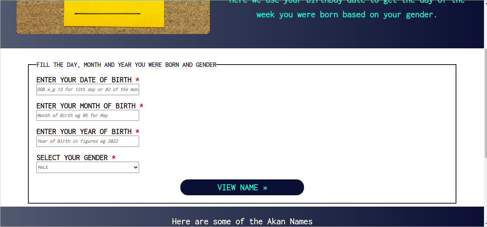

# Akan Naming Application

##### Reuben Kipkemboi 

## Table of Content

+ [Description](#Description)
+ [Installation Requirement](#Installation)
+ [Technology Used](#technologies-used)
+ [License](#license)
+ [Authors Info](#authors-info)

# Description.
Akan Naming application is an application to get the users name and the day of the wek they were born depending on the gender.It takes the day of birth the month and the year then displays your Akan Name and the day of the week you ere born depending on your gender.The names are derived from the days of the week in which one was born as per the following criteria:

| Day of the Week | Male Name | Female Name |
| ----------- | ----------- | ----------- |
| Sunday      | Kwasi       | Akosua      |
| Monday      | Kwadwo      | Adwoa
| Tuesday     | Kwabena     | Abenaa      |
| Wednesday   | Kwaku       | Akua        |
| Thursday    | Yaw         | Yaa         |
| Friday      | Kofi        | Afua        |
| Saturday    | Kwame       | Ama         |

The name corresponds with the day of the week in which your were born.

## User Stories
* Users will be able to see a small description of the application from the homepage.
* Users will enter the date , month and year of birth through a form.
* User can select the gender from the options available.
* A user via the click of a button the user gets an alert of the name and birthday date. 

# Behaviour Driven Development
* The user has the form to input day , month and year of birth and also select gender.
* Error Message is displayed when:
<ol>
<li>The User tries submitting an Empty form or null values</li>
<li>Incorrect date, month and year formats</li>
<li>Skipping any of the fields and trying to submit the form.</li>
</ol>

## Installation
+ A device that can connect to the internet.
+ Internet connection.

[Go Back to the top](#akan-naming-application)

## Technologies Used

* HTML -To structure the layout of the portfolio page. 

* CSS - To style the webpage and make it appealing.

* JavaScript - To enhance dynamic interaction with the user.

[Go Back to the top](#akan-naming-application)

## License
[MIT License](LICENSE)

## Authors Info
* Slack - [Reuben Kipkemboi]()

* Email - [Reuben Kipkemboi](https://gmail.com)

# live site
* #### https://reuben-kipkemboi.github.io/Naming-Application/

